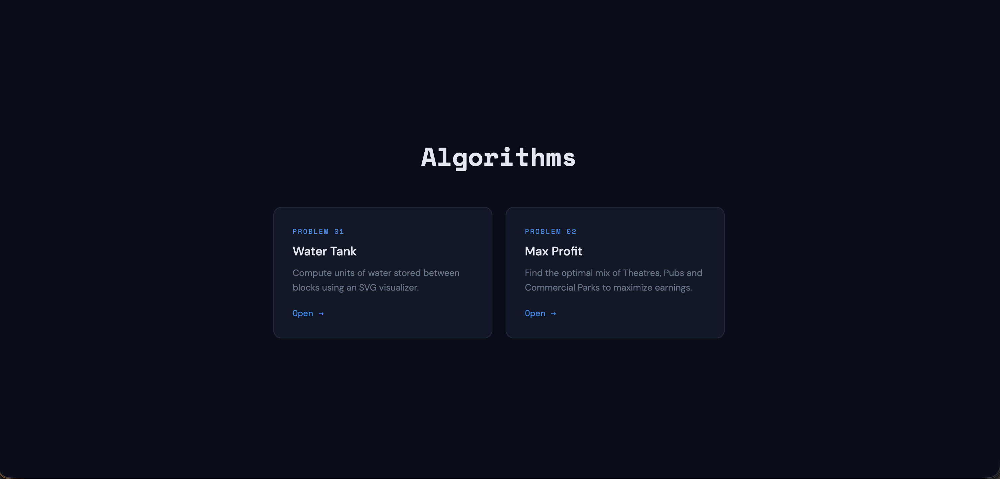
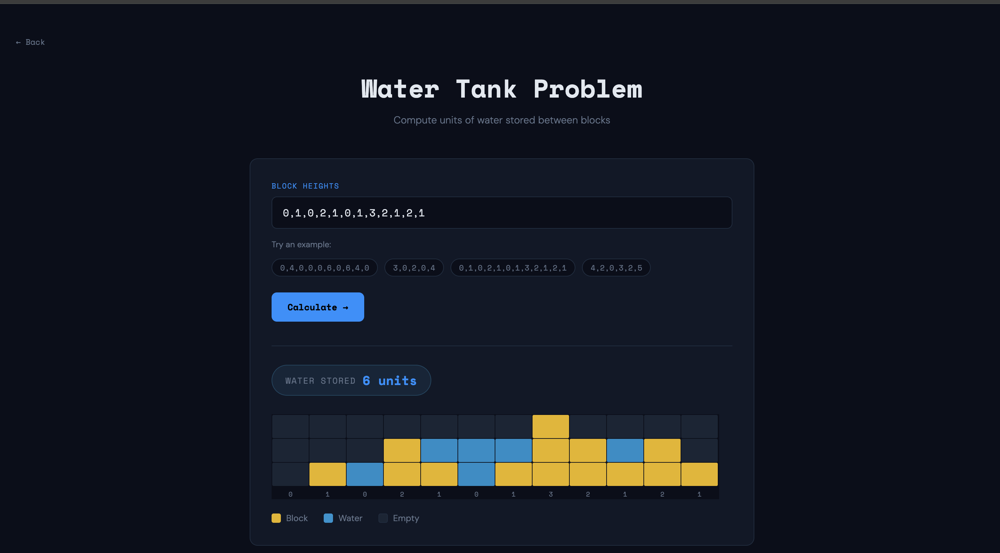
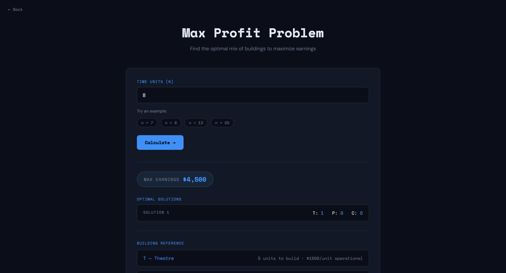

# Algorithms Visualizer

## Overview

## Problems

### 1. Water Tank
**Description:** Compute units of water stored between blocks using an SVG visualizer.
**Solution:** Calculates the water trapped between blocks given an array of heights. The visualizer updates dynamically based on the input.

### 2. Max Profit
**Description:** Find the optimal mix of Theatres, Pubs and Commercial Parks to maximize earnings.
**Solution:** Uses an optimization approach to establish the best combination of commercial properties to build based on their individual build times and revenue generation rates.

## Technologies Used
- HTML5
- CSS3
- Vanilla JavaScript

## How to Run
Simply open `index.html` in your web browser.
